<!-- slide -->
# pointer

<!-- slide -->

``` c = 1
int a = 100;
```

<!-- [a](../../../image/2019-10-30-13-24-09.png) -->

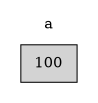
<!-- slide -->

``` C++
#include <stdio.h>
int main(){
    int a = 100;
    printf("%d\n", a);
    printf("0x%x\n", &a);
}
```

<!-- slide -->

``` output = 1
> 100
> 0x61ff2c
```

<!-- slide -->

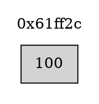

<!-- slide -->

``` c = 1
int *b = 0x61ff2c;
```

<!-- [b](../../../image/2019-10-30-13-30-27.png)-->
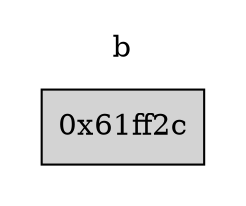
<!-- slide -->

``` c = 1
#include <stdio.h>
int main(){
    int a = 100;
    int *b = 0x61ff2c;
    printf("%x\n", &a);
    printf("%x\n", b);
    printf("%x\n", &b);
}
```

<!-- slide -->
``` output = 1
> 0x61ff2c
> 0x61ff2c
> 0x61ff28
```

<!-- slide -->

<!-- [a -> b](../../../image/2019-10-30-13-36-15.png) -->
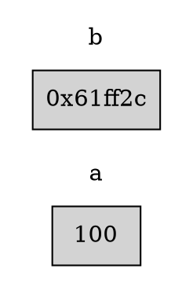

<!-- slide -->

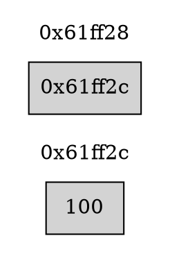

<!-- slide -->

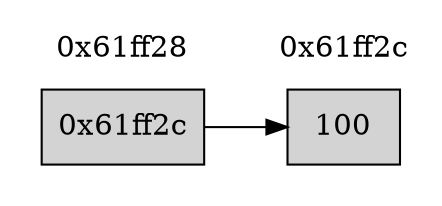

<!-- slide -->

``` c = 1
#include <stdio.h>
int main(){
    int a = 100;
    int *b = &a;
    printf("%d\n", *b);
}
```

<!-- slide -->
``` output = 1
> 100
```

<!-- slide -->

## 題目1

<!-- slide -->

### 題目1-敘述

利用框架寫一個function，將傳入的兩個值交換

<!-- slide -->

### 題目1-框架

``` c = 1
#include <stdio.h>
void swap(int * n1, int * n2){
}
int main(){
    int num1, num2;
    scanf("%d%d", &num1, &num2);
    printf("before: %d %d\n", num1, num2);
    swap(&num1, &num2);
    printf("after: %d %d\n", num1, num2);
}
```

<!-- slide -->

### 題目1-範例輸入

``` text
3 4
```

### 題目1-範例輸出

``` text
> before: 3 4
> after: 4 3
```

<!-- slide -->

### 題目1-圖解

<!-- [](../../../image/2019-10-30-14-02-36.png)-->

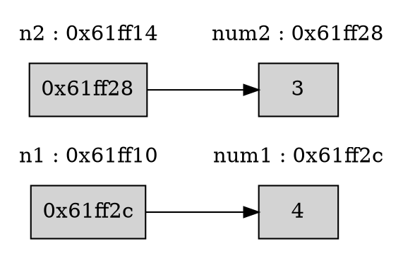

<!-- slide -->

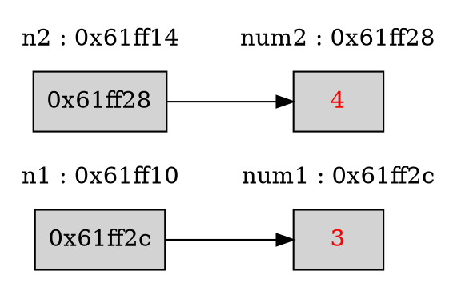

<!-- slide -->

### 題目1-程式碼

``` c = 1
#include <stdio.h>
void swap(int * n1, int * n2){
    int tmp = *n1;
    *n1 = *n2;
    *n2 = tmp;
}
int main(){
    int num1, num2;
    scanf("%d%d", &num1, &num2);
    printf("before: %d %d\n", num1, num2);
    swap(&num1, &num2);
    printf("after: %d %d\n", num1, num2);
}
```

<!-- slide -->
## Call by address

這種傳入指標的方式較做call by address

<!-- slide -->
### Call by value

``` c = 1
#include <stdio.h>
void swap(int n1, int n2){
    int tmp = n1;
    n1 = n2;
    n2 = tmp;
}
int main(){
    int num1, num2;
    scanf("%d%d", &num1, &num2);
    printf("before: %d %d\n", num1, num2);
    swap(num1, num2);
    printf("after: %d %d\n", num1, num2);
}
```

<!-- slide -->
``` text
< 3 4
> before: 3 4
> after: 3 4
```

<!-- slide -->
### Call by value 圖解

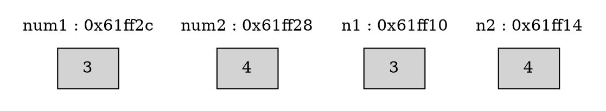

<!-- slide -->

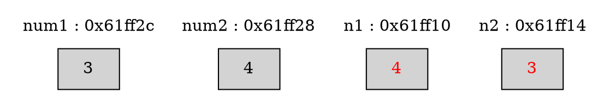

<!-- slide -->
### scanf 

``` C
scanf("%d%d", &num1, &num2);
```

* Call by address(?)
* Call by value(?)

<!-- slide -->

## 題目2

<!-- slide -->

### 題目2-敘述

利用框架寫一個function，找出陣列中的最大值與最小值
**此題有需要修改框架，來達成題意**

<!-- slide -->

### 題目2-框架

``` c = 1
#include <stdio.h>
#define MIN -2147483638
#define MAX 2147483647

void find(int * max, int * min, int arr, int arrSize){
    //TODO
}
int main(){
    int myArr[] = {3, 15, 9, 0, 44, 55, 31};
    int max, min;
    find(max, min, myArr, 7);
    printf("max: %d, min: %d\n", max, min);
}
```

<!-- slide -->

### 題目2-範例輸入

無

### 題目2-範例輸出

``` text
> max: 55, min: 0
```

<!-- slide -->
### 題目2-程式碼

``` c = 1
#include <stdio.h>
#define MIN -2147483638
#define MAX 2147483647

void find(int * max, int * min, int arr[], int arrSize){
    *max = MIN;
    *min = MAX;
    for(int i = 0; i < arrSize; i++){
        if(arr[i] > *max){
            *max = arr[i];
        }
        if(arr[i] < *min){
            *min = arr[i];
        }
    }
}

int main(){
    int myArr[] = {3, 15, 9, 0, 44, 55, 31};
    int max, min;
    find(&max, &min, myArr, 7);
    printf("max: %d, min: %d\n", max, min);
}
```

<!-- slide -->
## 陣列 VS 指標

<!-- slide -->
### 陣列程式碼

``` C++
int main(){
    int a[] = {0, 1, 2, 3, 4, 5, 6, 7};
}
```

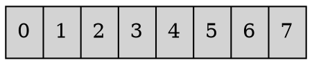

<!-- slide -->

``` C++
int main(){
    int a[] = {0, 1, 2, 3, 4, 5, 6, 7};
}
```

<!-- slide -->

``` C++
#include <stdio.h> 
int main(){
    int a[] = {0, 1, 2, 3, 4, 5, 6, 7};
    printf("0x%x", a);
}
```
<!-- slide -->
``` text
> 0x61ff10
```

<!-- slide -->

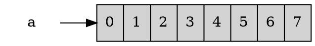

<!-- slide -->

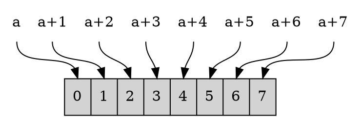

<!-- slide -->

``` C
#include <stdio.h> 
int main(){
    int a[] = {0, 1, 2, 3, 4, 5, 6, 7};
    for(int i = 0; i < 8; i++){
        printf("0x%x ", a+i);
    }
    printf("\n");
    for(int i = 0; i < 8; i++){
        printf("%d ", *(a + i));
    }
    printf("\n");
}
```

<!-- slide -->

``` text
> 0x61ff08 0x61ff0c 0x61ff10 0x61ff14 0x61ff18 0x61ff1c 0x61ff20 0x61ff24
> 0 1 2 3 4 5 6 7
```


<!-- slide -->
### array的address差距

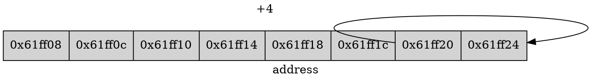

<!-- slide -->

## 題目3

<!-- slide -->

### 題目3-敘述

利用框架寫一個function，可以傳入大小不固定的陣列，並且排序
**此題有需要修改框架，來達成題意**

<!-- slide -->

### 題目2-框架

``` c = 1
#include <stdio.h>
#define MIN -2147483638
#define MAX 2147483647

void find(int * max, int * min, int arr, int arrSize){
    //TODO
}
int main(){
    int myArr[] = {3, 15, 9, 0, 44, 55, 31};
    int max, min;
    find(max, min, myArr, 7);
    printf("max: %d, min: %d\n", max, min);
}
```

<!-- slide -->

### 題目2-範例輸入

無

### 題目2-範例輸出

``` text
> max: 55, min: 0
```

<!-- slide -->
### 題目2-程式碼

``` c = 1
#include <stdio.h>
#define MIN -2147483638
#define MAX 2147483647

void find(int * max, int * min, int arr[], int arrSize){
    *max = MIN;
    *min = MAX;
    for(int i = 0; i < arrSize; i++){
        if(arr[i] > *max){
            *max = arr[i];
        }
        if(arr[i] < *min){
            *min = arr[i];
        }
    }
}

int main(){
    int myArr[] = {3, 15, 9, 0, 44, 55, 31};
    int max, min;
    find(&max, &min, myArr, 7);
    printf("max: %d, min: %d\n", max, min);
}
```

<!-- slide -->
## 指標與其他符號

<!-- slide -->
### ++與*的程式碼

a) *ptr++是表示*(ptr++)的意思，就是ptr指向下一個位置所存的值(同arr[i++])。
b)*++ptr是代表ptr先做位址往前移，再取值(同arr[++i])。
c) ++*ptr是表示++(*ptr)之意，即為ptr當下位置的值+1(同++arr[i])。

