<!-- slide -->

# pointer

<!-- slide -->

``` c = 1
int a = 100;
```
<!-- [a](../../../image/2019-10-30-13-24-09.png) -->

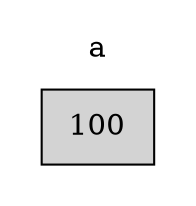
<!-- slide -->

``` C++
#include <stdio.h>
int main(){
    int a = 100;
    printf("%d\n", a);
    printf("0x%x\n", &a);
}
```

<!-- slide -->

``` output = 1
> 100
> 0x61ff2c
```

<!-- slide -->

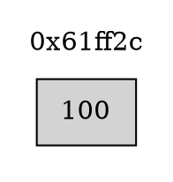

<!-- slide -->

``` c = 1
int *b = 0x61ff2c;
```

<!-- [b](../../../image/2019-10-30-13-30-27.png)-->
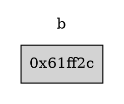
<!-- slide -->

``` c = 1
#include <stdio.h>
int main(){
    int a = 100;
    int *b = 0x61ff2c;
    printf("%x\n", &a);
    printf("%x\n", b);
    printf("%x\n", &b);
}
```

<!-- slide -->
``` output = 1
> 0x61ff2c
> 0x61ff2c
> 0x61ff28
```

<!-- slide -->

<!-- [a -> b](../../../image/2019-10-30-13-36-15.png) -->
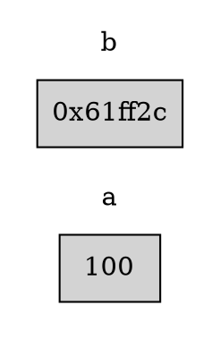

<!-- slide -->

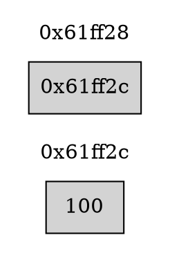

<!-- slide -->

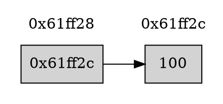

<!-- slide -->

``` c = 1
#include <stdio.h>
int main(){
    int a = 100;
    int *b = &a;
    printf("%d\n", *b);
}
```

<!-- slide -->
``` output = 1
> 100
```

<!-- slide -->

## 題目1

<!-- slide -->

### 題目1-敘述

利用框架寫一個function，將傳入的兩個值交換

<!-- slide -->

### 題目1-框架

``` c = 1
#include <stdio.h>
void swap(int * n1, int * n2){
}
int main(){
    int num1, num2;
    scanf("%d%d", &num1, &num2);
    printf("before: %d %d\n", num1, num2);
    swap(&num1, &num2);
    printf("after: %d %d\n", num1, num2);
}
```

<!-- slide -->

### 題目1-範例輸入

``` text
3 4
```

### 題目1-範例輸出

``` text
> before: 3 4
> after: 4 3
```

<!-- slide -->

### 題目1-圖解

<!-- [](../../../image/2019-10-30-14-02-36.png)-->

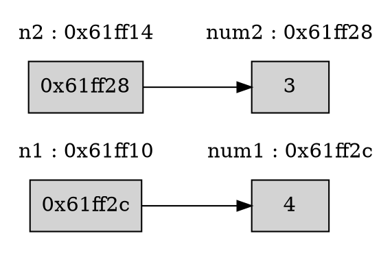

<!-- slide -->

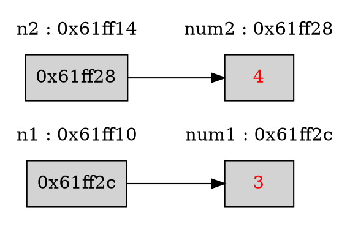

<!-- slide -->

### 題目1-程式碼

``` c = 1
#include <stdio.h>
void swap(int * n1, int * n2){
    int tmp = *n1;
    *n1 = *n2;
    *n2 = tmp;
}
int main(){
    int num1, num2;
    scanf("%d%d", &num1, &num2);
    printf("before: %d %d\n", num1, num2);
    swap(&num1, &num2);
    printf("after: %d %d\n", num1, num2);
}
```

<!-- slide -->
## Call by address

這種傳入指標的方式較做call by address

<!-- slide -->
### Call by value

``` c = 1
#include <stdio.h>
void swap(int n1, int n2){
    int tmp = n1;
    n1 = n2;
    n2 = tmp;
}
int main(){
    int num1, num2;
    scanf("%d%d", &num1, &num2);
    printf("before: %d %d\n", num1, num2);
    swap(num1, num2);
    printf("after: %d %d\n", num1, num2);
}
```

<!-- slide -->
``` text
< 3 4
> before: 3 4
> after: 3 4
```

<!-- slide -->
### Call by value 圖解

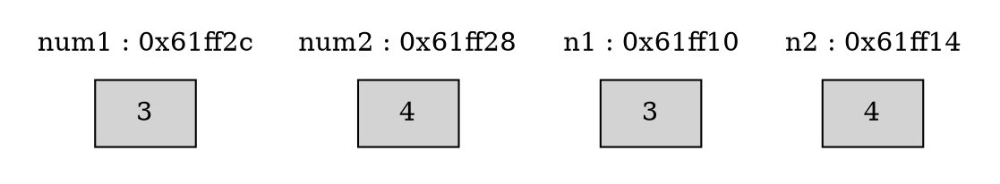

<!-- slide -->

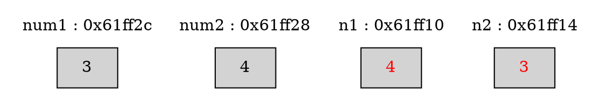

<!-- slide -->
### scanf 

``` C
scanf("%d%d", &num1, &num2);
```

* Call by address(?)
* Call by value(?)

<!-- slide -->

## 題目2

<!-- slide -->

### 題目2-敘述

利用框架寫一個function，找出陣列中的最大值與最小值
**此題有需要修改框架，來達成題意**

<!-- slide -->

### 題目2-框架

``` c = 1
#include <stdio.h>
#define MIN -2147483638
#define MAX 2147483647

void find(int * max, int * min, int arr, int arrSize){
    //TODO
}
int main(){
    int myArr[] = {3, 15, 9, 0, 44, 55, 31};
    int max, min;
    find(max, min, myArr, 7);
    printf("max: %d, min: %d\n", max, min);
}
```

<!-- slide -->

### 題目2-範例輸入

無

### 題目2-範例輸出

``` text
> max: 55, min: 0
```

<!-- slide -->
### 題目2-圖解

min = 2147483647
max = -2147483648

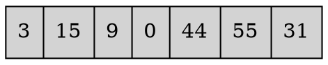

<!-- slide -->
min = 3
max = 3
i = 0


<!-- slide -->
min = 3
max = 15
i = 1


<!-- slide -->
min = 3
max = 15
i = 2


<!-- slide -->
min = 0
max = 15
i = 3


<!-- slide -->
min = 0
max = 44
i = 4


<!-- slide -->
min = 0
max = 55
i = 5


<!-- slide -->
min = 0
max = 55
i = 6


<!-- slide -->
min_index = 0
min = 3
i = 0
j = 1


<!-- slide -->
min_index = 0
min = 3
i = 0
j = 2


<!-- slide -->
min_index = 3
min = 0
i = 0
j = 3

``` dot
digraph G {
    rankdir=LR;
    color=lightgray;
    array [label="{<f0> 3 |<f1> 15 |<f2> 9 |<f3> 0 |<f4> 44 |<f5> 55 |<f6> 31}",shape=record, style=filled];
}
```

<!-- slide -->
min_index = 3
min = 0
i = 0
j = 4

``` dot
digraph G {
    rankdir=LR;
    color=lightgray;
    array [label="{<f0> 3 |<f1> 15 |<f2> 9 |<f3> 0 |<f4> 44 |<f5> 55 |<f6> 31}",shape=record, style=filled];
}
```

<!-- slide -->
min_index = 3
min = 0
i = 0
j = 5

``` dot
digraph G {
    rankdir=LR;
    color=lightgray;
    array [label="{<f0> 3 |<f1> 15 |<f2> 9 |<f3> 0 |<f4> 44 |<f5> 55 |<f6> 31}",shape=record, style=filled];
}
```

<!-- slide -->
min_index = 3
min = 0
i = 0
j = 6

``` dot
digraph G {
    rankdir=LR;
    color=lightgray;
    array [label="{<f0> 3 |<f1> 15 |<f2> 9 |<f3> 0 |<f4> 44 |<f5> 55 |<f6> 31}",shape=record, style=filled];
}
```

<!-- slide -->
min_index = 3
min = 0
i = 0
j = 6

``` dot
digraph G {
    rankdir=LR;
    color=lightgray;
    array [label="{<f0> 0 |<f1> 15 |<f2> 9 |<f3> 3 |<f4> 44 |<f5> 55 |<f6> 31}",shape=record, style=filled];
}
```

<!-- slide -->
min_index = 1
min = 15
i = 1
j = 2

``` dot
digraph G {
    rankdir=LR;
    color=lightgray;
    array [label="{<f0> 0 |<f1> 15 |<f2> 9 |<f3> 3 |<f4> 44 |<f5> 55 |<f6> 31}",shape=record, style=filled];
}
```

<!-- slide -->
min_index = 1
min = 15
i = 1
j = 3

``` dot
digraph G {
    rankdir=LR;
    color=lightgray;
    array [label="{<f0> 0 |<f1> 15 |<f2> 9 |<f3> 3 |<f4> 44 |<f5> 55 |<f6> 31}",shape=record, style=filled];
}
```


<!-- slide -->
min_index = 3
min = 3
i = 1

``` dot
digraph G {
    rankdir=LR;
    color=lightgray;
    array [label="{<f0> 0 |<f1> 3 |<f2> 9 |<f3> 15 |<f4> 31 |<f5> 44 |<f6> 55}",shape=record, style=filled];
}
```

<!-- slide -->

``` dot
digraph G {
    rankdir=LR;

    subgraph cluster0 {
        node [style=filled, shape=box];
        color=white;
        a [label = "XXXXX"];
        label = "main: max";
    }

    subgraph cluster1 {
        node [style=filled, shape=box];
        color=white;
        b [label = "XXXXX"];
        label = "main: min";
    }

}
```


<!-- slide -->

``` dot
digraph G {
    rankdir=LR;

      subgraph cluster0 {
        node [style=filled, shape=box];
        color=white;
        a [label = "2147483647"];
        label = "main: max";
    }

    subgraph cluster1 {
        node [style=filled, shape=box];
        color=white;
        b [label = "-2147483648"];
        label = "main: min";
    }

    subgraph cluster2 {
        node [style=filled, shape=box];
        color=white;
        b2 [label = "main: min"];
        label = "find:min";
    }

    subgraph cluster3 {
        node [style=filled, shape=box];
        color=white;
        a2 [label = "main: max"];
        label = "find:max";
    }
    a2->a;
    b2->b;
}
```


<!-- slide -->

``` dot
digraph G {
    rankdir=LR;

      subgraph cluster0 {
        node [style=filled, shape=box];
        color=white;
        a [label = "XXXX"];
        label = "main: max";
    }

    subgraph cluster1 {
        node [style=filled, shape=box];
        color=white;
        b [label = "XXXX"];
        label = "main: min";
    }

    subgraph cluster2 {
        node [style=filled, shape=box];
        color=white;
        b2 [label = "2147483647"];
        label = "find:min";
    }

    subgraph cluster3 {
        node [style=filled, shape=box];
        color=white;
        a2 [label = "-2147483648"];
        label = "find:max";
    }
}
```


<!-- slide -->
### 題目2-程式碼1

``` c = 1
#include <stdio.h>
#define MIN -2147483638
#define MAX 2147483647

void find(int * max, int * min, int arr[], int arrSize){
    *max = MIN;
    *min = MAX;
    for(int i = 0; i < arrSize; i++){
        if(arr[i] > *max){
            *max = arr[i];
        }
        if(arr[i] < *min){
            *min = arr[i];
        }
    }
}

```
<!-- slide -->
### 題目2-程式碼2

``` c = 1

int main(){
    int myArr[] = {3, 15, 9, 0, 44, 55, 31};
    int max, min;
    find(&max, &min, myArr, 7);
    printf("max: %d, min: %d\n", max, min);
}
```

<!-- slide -->
## 陣列 VS 指標

<!-- slide -->
### 陣列程式碼

``` C++
int main(){
    int a[] = {0, 1, 2, 3, 4, 5, 6, 7};
}
```

``` dot
digraph G {
    rankdir=LR;
    color=lightgray;
    array [label="{<f0> 0 |<f1> 1 |<f2> 2 |<f3> 3 |<f4> 4 |<f5> 5 |<f6> 6 |<f7> 7}",shape=record, style=filled];
}
```

<!-- slide -->

``` C++
int main(){
    int a[] = {0, 1, 2, 3, 4, 5, 6, 7};
}
```

<!-- slide -->

``` C++
#include <stdio.h> 
int main(){
    int a[] = {0, 1, 2, 3, 4, 5, 6, 7};
    printf("0x%x", a);
}
```
<!-- slide -->
``` text
> 0x61ff10
```

<!-- slide -->

``` dot
digraph G {
    rankdir=LR;
    color=lightgray;
    array [label="{<f0> 0 |<f1> 1 |<f2> 2 |<f3> 3 |<f4> 4 |<f5> 5 |<f6> 6 |<f7> 7}",shape=record, style=filled];
    a [shape=none];
    a->array:f0;
}
```

<!-- slide -->

``` dot
digraph G {
    color=lightgray;
    array [label="{{<f0> 0 |<f1> 1 |<f2> 2 |<f3> 3 |<f4> 4 |<f5> 5 |<f6> 6 |<f7> 7}}",shape=record, style=filled];
    array2 [label="{{<f0> a |<f1> a+1 |<f2> a+2 |<f3> a+3 |<f4> a+4 |<f5> a+5 |<f6> a+6 |<f7> a+7}}",shape=record, style=filled, color=white];
    node [shape=none];
    array2:f0->array:f0;
    array2:f1->array:f1;
    array2:f2->array:f2;
    array2:f3->array:f3;
    array2:f4->array:f4;
    array2:f5->array:f5;
    array2:f6->array:f6;
    array2:f7->array:f7;
}
```

<!-- slide -->

``` C
#include <stdio.h> 
int main(){
    int a[] = {0, 1, 2, 3, 4, 5, 6, 7};
    for(int i = 0; i < 8; i++){
        printf("0x%x ", a+i);
    }
    printf("\n");
    for(int i = 0; i < 8; i++){
        printf("%d ", *(a + i));
    }
    printf("\n");
}
```

<!-- slide -->

``` text
> 0x61ff08 0x61ff0c 0x61ff10 0x61ff14 0x61ff18 0x61ff1c 0x61ff20 0x61ff24
> 0 1 2 3 4 5 6 7
```


<!-- slide -->
### array的address差距

``` dot
digraph G {
    rankdir=LR;
    label="address"
    color=lightgray;
    array [label="{
        <f0> 0x61ff08 |
        <f1> 0x61ff0c |
        <f2> 0x61ff10 |
        <f3> 0x61ff14 |
        <f4> 0x61ff18 |
        <f5> 0x61ff1c |
        <f6> 0x61ff20 |
        <f7> 0x61ff24}",shape=record, style=filled];
    array:f6->array:f7 [label="+4"];
}
```

<!-- slide -->

## 題目3

<!-- slide -->

### 題目3-敘述

美美是一個文科生，她為了製作報告，必須收集一些資料。但美美她對程式不是很了解，所以需要你幫助她寫好一些處理資料的函式，讓她可以透過那些函式，簡單的完成報告。

<!-- slide -->
### 美美需要的函式

``` c
//讀入size個值，並依序放進陣列
void inputArray(int * arr, int size);

//輸出陣列中的每一個數，每個數之間用空白隔開，結尾需要換行
void outputArray(int * arr, int size);

//copy陣列並回傳
int* copyArray(int * arr, int size);

//排序陣列
void sortArray(int * arr, int size);

//回傳找到位置的指標，如果找不到請回傳NULL
int* searchValueInArray(int * arr, int arrSize, int value);

```

<!-- slide -->
### 美美目前撰寫的程式碼

``` c
int main(){
    int arr1[] = {88, 33, 43, 54, 92, 55};
    int arr2[] = {3423, 453, 3256, 12, 464, 6537, 23, 452, 235, 54, 0};
    int arr3[5] = {}, *arr4;
    int arr1Size = 6, arr2Size = 11, arr3Size = 5, arr4Size = 0;

    sortArray(arr2, arr2Size);
    inputArray(arr3, arr3Size);
    *(searchValueInArray(arr3, arr3Size, 101)) += 100;

    arr4 = copyArray(arr1, arr1Size);
    arr4Size = arr1Size;
    *(searchValueInArray(arr4, arr3Size, 88)) = 20;

    outputArray(arr1, arr1Size);
    outputArray(arr3, arr3Size);
    outputArray(arr4, arr4Size);
    system("pause");
}
```

<!-- slide -->

### 題目3-範例輸入

``` text
20 30 101 43 32
```

### 題目3-範例輸出

``` text
> 88 33 43 54 92 55
> 20 30 201 43 32
> 20 33 43 54 92 55
```

<!-- slide -->
## 題目3-測資2-main

``` c
int main(){
    int sen[] = {65, 72, 0, 0, 'p', 121, -1, 116, 105, 114, 66, 104, 100, 97, 10000, 33, 94, 118, 94, 382};
    int size1 = 20;

    int * exist = searchValueInArray(sen, size1, -1);
    if(exist) *exist += 33;
    int * notExist = searchValueInArray(sen, size1, 1023);
    if(notExist) *notExist = -21324;

    inputArray(sen + 2, 2);
    sortArray(sen + 7, 4);

    int *sen2;
    int size2 = size1 - 2;
    sen2 = copyArray(sen + 1, size2);

    exist = searchValueInArray(sen2, size2, 10000);
    if(exist) *exist = 121;

    for(int i = 0; i < size2; i++){
        printf("%c", *(sen2 + i));
    }
    system("pause");
}
```

<!-- slide -->
## 題目3-測資2-輸入

``` text
97 112
```

<!-- slide -->
### 題目3-程式碼1

``` c = 1
#include <stdio.h>
#include <stdlib.h>

void inputArray(int * arr, int size){
    for(int i = 0; i < size; i++){
        scanf("%d", arr + i);
    }
}

void outputArray(int * arr, int size){
    for(int i = 0; i < size; i++){
        printf("%d ", *(arr + i));
    }
    printf("\n");
}

int* copyArray(int * arr, int size){
    int *newArr = (int*)malloc(sizeof(int) * size);
    for(int i = 0; i < size; i++){
        *(newArr + i) = *(arr + i);
    }
    return newArr;
}

```
<!-- slide -->
### 題目3-程式碼2

``` c = 1

void sortArray(int * arr, int size){
    for(int i = 0; i < size - 1; i++){
        int *min = arr + i;
        for(int j = i + 1; j < size; j++){
            if(*(arr + j) < *min) min = arr + j;
        }
        int tmp = *min;
        *min = *(arr + i);
        *(arr + i) = tmp;
    }
}

int* searchValueInArray(int * arr, int arrSize, int value){
    for(int i = 0; i < arrSize; i++){
        if(*(arr + i) == value) return arr + i;
    }
    return NULL;
}
```
<!-- slide -->
美美看到你的程式，覺得非常滿意，相信剩下的部分她可以獨自完成的~
也希望下次能繼續合作

<!-- slide -->
### array與pointer不一樣的特性

``` c
#include <stdio.h>

int main(){
    int arr[] = {111};
    int *ptr;

    ptr = arr; // 這是合法
    
    int arr2[] = arr; // 這是不合法
    arr = ptr; // 這是不合法
}
```

<!-- slide -->
### array與pointer不一樣的特性2

``` c
#include <stdio.h>
int main(){
    int arr[] = {1, 2, 3, 4, 5, 6, 7, 8, 9, 10};
    int *ptr = arr;

    printf("sizeof(array): %d\n", sizeof(arr));
    printf("sizeof(pointer): %d\n", sizeof(ptr));
}

```

<!-- slide -->
``` text
> sizeof(array): 40
> sizeof(pointer): 4
```
