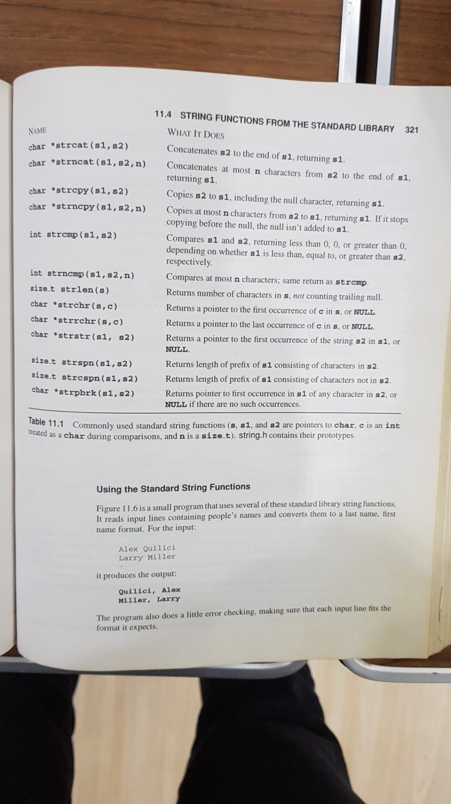

# 學校作業

## Pig Latin

Pig Latin is a form of coded language often used for amusement. Many variations exist in the methods used to form pig Latin phrases. Write a program that encodes English language phrases into pig Latin using the following algorithm:
To translate an English word into a pig Latin word, place the first letter of the English word at the end of the word and then add the letters “ay” to it. Thus the word “jump” becomes “umpjay”, and the word “computer” becomes “omputercay”.
Input to the program consists of 100-character lines of English words separated by a blank, blanks, or eoln. All words are made up of the English alphabets, and no punctuation marks are present. You may assume the maximum word length is 40; You must display the coded text, right justified, at the end. Change the line length to 80 characters long for the output.

## 將函式實作

